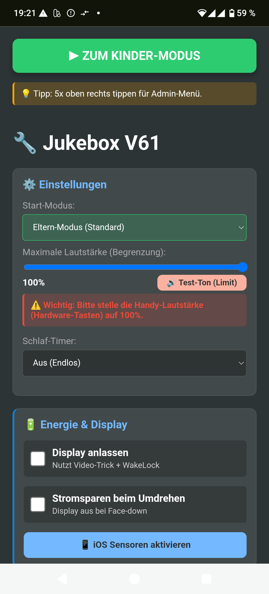
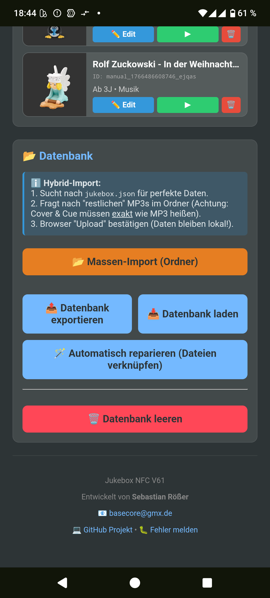
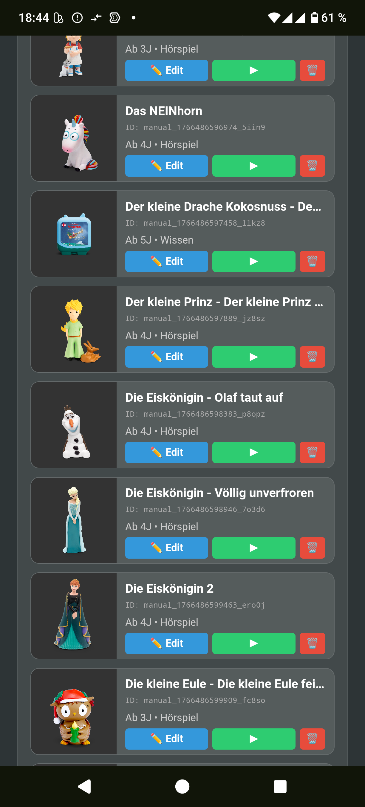
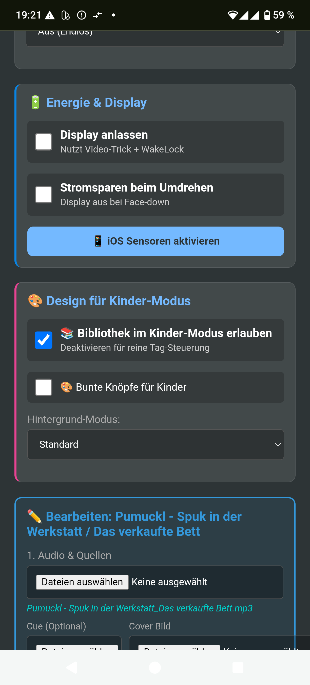

# 🎵 Jukebox PWA (v55 Library Ultimate) - Die DIY "Toniebox" fürs Handy

Eine kinderfreundliche Musik-Player-App, die als Progressive Web App (PWA) direkt im Browser läuft. Sie verwandelt alte Smartphones in sichere Abspielgeräte für Kinder.

**Das Highlight in v55:** Die neue **Bibliotheks-Ansicht** wurde perfektioniert (Layout-Fix für Buttons) und bietet nun eine visuelle Übersicht im Stil einer "Tigerbox" – inklusive Filter, "Zuletzt gehört" und Info-Details.

Entwickelt als lokale Lösung: **Kein Cloud-Zwang, kein Tracking, komplett kostenlos.**

---

## 📸 Vorschau

Die App ist in zwei Bereiche unterteilt: Den geschützten **Eltern-Modus** (Verwaltung) und den kindersicheren **Player-Modus**.

### 👶 Kinder-Modus & Bibliothek
Hier spielen die Kinder. Große Bilder, keine Text-Menüs, einfache Bedienung.

| **Der Player** | **Die Bibliothek** |
|:---:|:---:|
|  |  |
| *Große Steuerung & Cover* | *Visuelles Stöbern & Filtern* |

| **Info-Overlay** | **Details & Dauer** |
|:---:|:---:|
|  |  |
| *Beschreibung & Alter* | *Einfacher Player* |

### 🔧 Eltern-Modus (Admin)
Hier verwaltest du die Datenbank, importierst Musik und stellst Limits ein.

| **Einstellungen & Limits** | **Datenbank & Import** |
|:---:|:---:|
|  |  |
| *Lautstärkelimit & Timer* | *Massen-Import & Reparatur* |

| **Verwaltung** | **Design & Bibliothek** |
|:---:|:---:|
|  |  |
| *Tags bearbeiten* | *Bibliothek an/ausschalten* |

---

## 📲 Installation (Android)

Die App muss nicht über den Play Store geladen werden, sondern wird direkt über den Browser installiert.

1.  Öffne **Chrome** auf deinem Android-Smartphone.
2.  Rufe die Webseite auf: **[https://basecore.github.io/jukebox/](https://basecore.github.io/jukebox/)**
3.  **Warte kurz (bis zu 30 Sekunden):** Oft erscheint am unteren Bildschirmrand automatisch ein Hinweis *"Jukebox zum Startbildschirm hinzufügen"*.
4.  Falls nicht, folge diesen Schritten:

| **1. Menü öffnen** | **2. Installieren** |
|:---:|:---:|
|  |  |
| *Tippe oben rechts auf die 3 Punkte* | *Wähle "App installieren"* |

| **3. Bestätigen** | **4. Widget platzieren** |
|:---:|:---:|
|  |  |
| *Klicke auf "Installieren"* | *Automatisch oder ziehen* |

---

## ✨ Neue Features (v55 & Library)

### 📚 Die Bibliothek (Tigerbox-Style)
Zusätzlich zur NFC-Steuerung können Kinder nun visuell durch ihre Sammlung stöbern.
* **Layout Fix (v55):** Die Ansicht nutzt nun ein robustes Block-Layout, sodass Filter-Buttons auf kleinen Bildschirmen nicht mehr gequetscht werden, sondern sauber scrollbar sind.
* **Visuelle Übersicht:** Große Cover-Kacheln in einem übersichtlichen Raster.
* **🕒 Zuletzt gehört:** Die letzten 3 gestarteten Hörspiele werden oben sofort angezeigt (History-Funktion).
* **🔍 Smart Filter:** Automatische Filter-Buttons basierend auf deiner `jukebox.json` (z.B. *"Ab 3 Jahren"*, *"Hörspiel"*, *"Musik"*).
* **ℹ️ Info-Overlay:** Ein Klick auf den kleinen **"i"-Button** auf dem Cover öffnet ein Fenster mit Beschreibungstext, Laufzeit und Altersempfehlung.

### 🛡️ Erweiterte Eltern-Kontrolle
* **Bibliothek sperren:** Du kannst in den Einstellungen den Haken bei *"📚 Bibliothek im Kinder-Modus erlauben"* entfernen, wenn das Kind nur mit physischen Figuren spielen soll.
* **Start-Modus:** Lege fest, ob die App beim Öffnen direkt im gesicherten Kinder-Modus starten soll.

---

## 🚀 Basis-Funktionen

* **Offline-First:** Dank Service Worker (`sw.js`) funktioniert die App auch ohne Internet (nach dem ersten Laden).
* **NFC-Support:** Musik starten durch Auflegen von Tags (NTAG213/215) oder alten Tonie-Figuren (Android only).
* **📂 Massen-Import:** Ziehe ganze Ordner in die App. Die `jukebox.json` sorgt für perfekte Metadaten.
* **🔉 Lautstärkebegrenzung:** Setze ein festes Limit zum Schutz der Kinderohren.
* **💾 Smart Resume:** Merkt sich die exakte Stelle jedes Hörspiels.
* **🌗 Eco-Modus:** Display wird schwarz (und spart Akku), wenn das Handy auf das Gesicht gelegt wird.
* **🛌 Schlaf-Timer:** Musik blendet nach X Minuten sanft aus.

---

## ⚠️ Wichtige Hinweise

1.  **iOS / iPhone:**
    * Auf iPhones funktioniert die **NFC-Funktion nicht** (Apple-Beschränkung).
    * **Aber:** Dank der neuen **Bibliothek** ist die App nun auch auf iPhones als vollwertiger, kindersicherer Player perfekt nutzbar!
2.  **Keine "Wegnahme"-Erkennung:** Die Musik stoppt nicht, wenn die Figur weggenommen wird (Pause-Knopf drücken).
3.  **Hosting:** Damit NFC und Sensoren funktionieren, muss die App über `https://` (GitHub Pages) oder `localhost` laufen.

---

## 📖 Bedienungsanleitung

### 1. Musik hinzufügen & Bibliothek pflegen
Die Bibliothek entfaltet ihre volle Stärke mit einer gepflegten `jukebox.json`.

**Empfohlener Weg: Massen-Import**
1.  Erstelle am PC eine Ordnerstruktur mit deinen MP3s und Covern.
2.  Erstelle eine `jukebox.json` im Hauptordner.
3.  Gehe im Eltern-Modus auf **"📂 Massen-Import"** und wähle den Ordner.

**Format der `jukebox.json` für die Bibliothek:**
Damit Filter ("Ab 4 Jahren") und Info-Texte erscheinen, nutze dieses Format:

```json
{
  "tagId": "meine_id_123",
  "name": "Benjamin Blümchen - Als Koch",
  "playlistFileNames": ["Benjamin_Koch.mp3"],
  "imageFileName": "Benjamin_Koch.jpg",
  "meta": {
    "description": "Benjamin hilft im Zoo-Restaurant aus...",
    "age_recommendation": 3,
    "genre": "Hörspiel",
    "runtime": 45
  }
}
