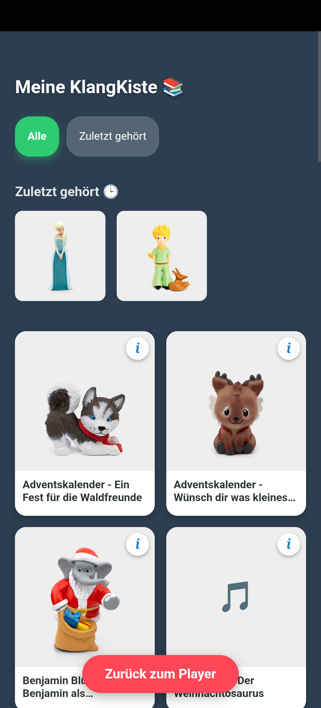
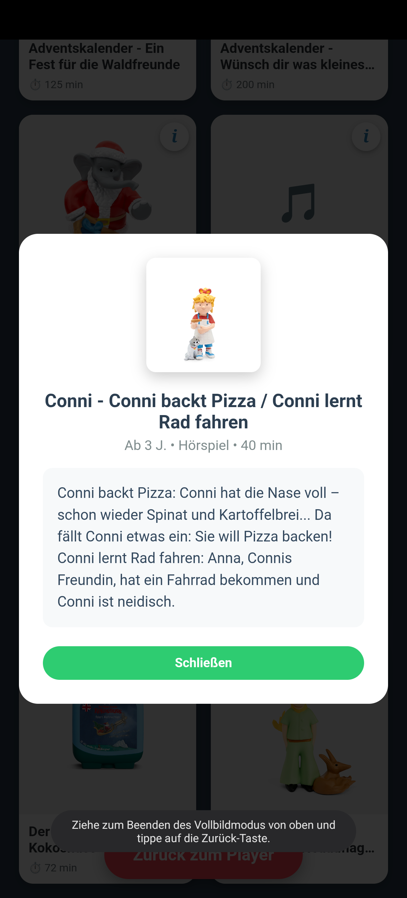
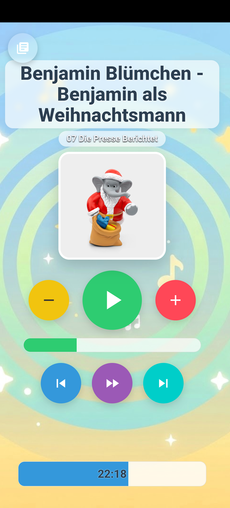
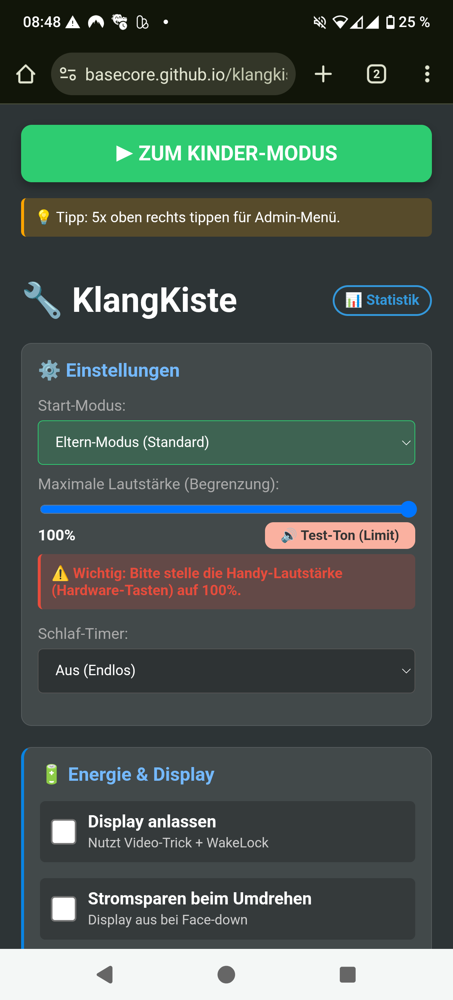
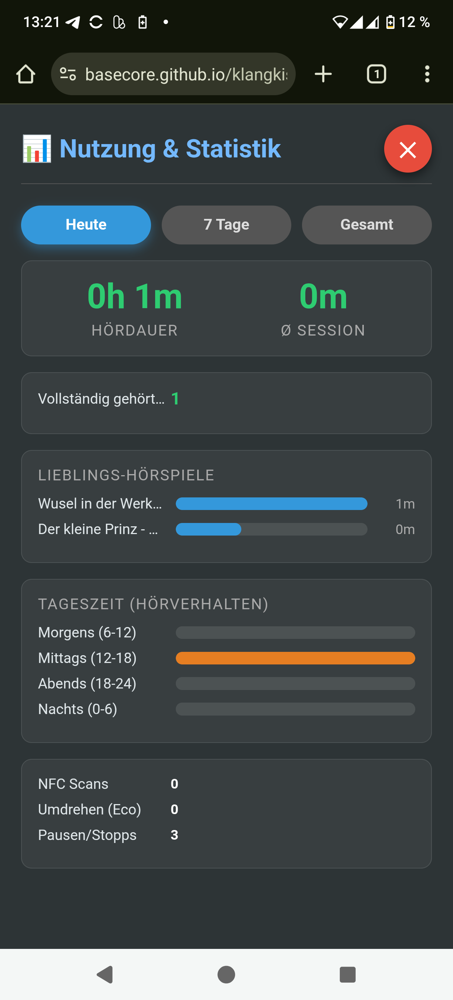
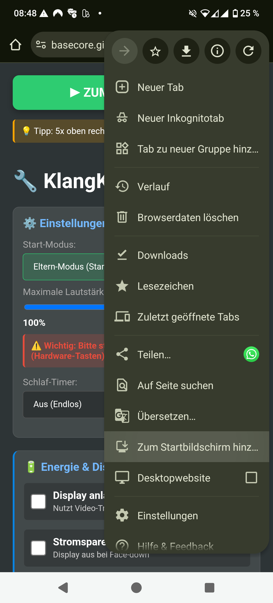
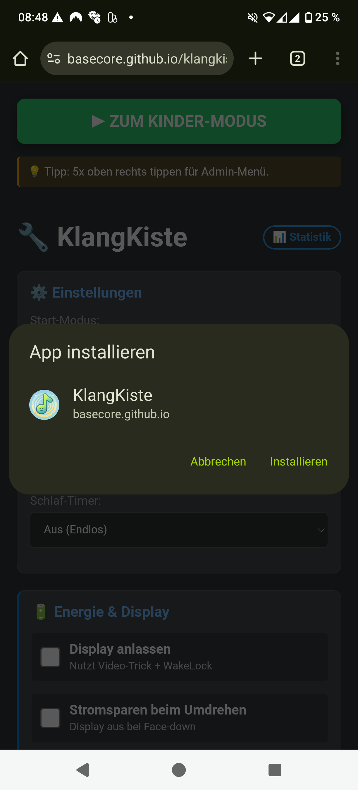
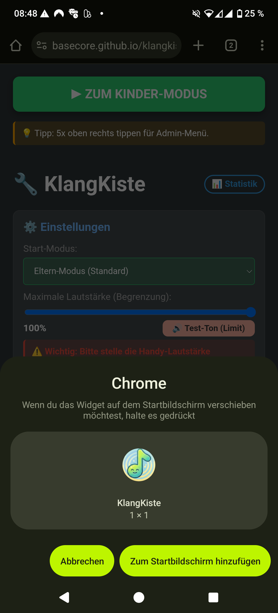
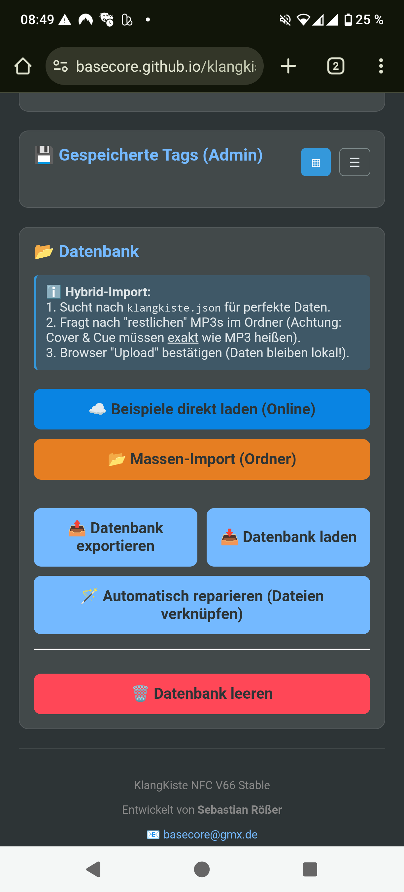

# 🎵 KlangKiste PWA (V76 Smart Folder Edition)

**Die smarte DIY "Toniebox" fürs Handy – 100% AI-Generated Code.**

Dieses Projekt ist eine kinderfreundliche Musik-Player-App, die alte Smartphones in sichere, werbefreie Abspielgeräte verwandelt. Sie läuft als **Progressive Web App (PWA)** komplett offline im Browser und nutzt IndexedDB zur Speicherung von hunderten Hörspielen.

> 🤖 **Made with Gemini:** Dieses gesamte Projekt (HTML, CSS, JavaScript Logik, Datenbank-Struktur) wurde vollständig durch **Google Gemini 3 Pro** erstellt und analysiert. Es ist ein Experiment, wie weit KI-gestützte Entwicklung ohne manuelles Coden gehen kann.

---

## ✨ Neu in v76: Der Smart Folder Import

Das Highlight dieser Version ist die intelligente Erkennung von Ordnerstrukturen. Das mühsame manuelle Anlegen von Alben entfällt!

### 📂 1. "Smart Folder" Struktur-Import (Neu in v76)
Du hast deine Hörspiele am PC bereits in Ordnern sortiert? Perfekt!
* **Wie es funktioniert:** Wähle einen Oberordner (z.B. "Meine Hörspiele") aus.
* **Die Magie:** Die App erkennt automatisch jeden Unterordner als **eigenes Album**.
* **Beispiel:**
    * `Hörspiele/Benjamin Blümchen/01 - Zoo.mp3` -> Wird Album "Benjamin Blümchen"
    * `Hörspiele/Leo Lausemaus/Titel.mp3` -> Wird Album "Leo Lausemaus"
* **Automatische Cover:** Wenn in einem Ordner ein Bild (jpg/png) liegt, wird es automatisch als Cover für dieses Album gesetzt.
* **Sortierung:** Dateien innerhalb des Ordners werden automatisch alphabetisch sortiert (01, 02, 03...).

### ⚡ 2. Admin Listen-Ansicht (Neu in v76)
Für Eltern mit großen Sammlungen (500+ Alben):
* **Umschaltbar:** Im Eltern-Modus kannst du nun zwischen **Raster (Grid)** und **Liste** umschalten.
* **Performance:** Die Listen-Ansicht benötigt kaum Rechenleistung und lädt sofort, auch auf sehr alten Handys.

---

## 🚀 Wichtige Funktionen aus v74/v75

Diese Funktionen sorgen für Datensicherheit und Performance auf älteren Geräten.

### 📦 Full System Backup & Restore
Der Export ist mächtiger denn je. Die `klangkiste_full_backup.json` speichert **den kompletten Zustand der App**:
* **Fortschritt:** Speichert für jedes Hörbuch die exakte Sekunde und das Kapitel.
* **Status:** Merkt sich, welche Hörbücher **versteckt** (Shadow-List) oder **abgeschlossen (✅)** sind.
* **Statistik:** Die gesamte Hör-Historie und Timeline bleibt erhalten.
* **Einstellungen:** Anpassungen (Lautstärke-Limit, Sleep-Timer, Filter) werden mitgesichert.

### 🧠 Smart RAM Management
Speziell für Geräte mit wenig Arbeitsspeicher (z.B. Galaxy S8). Beim Wechseln von Hörbüchern oder Schließen der Bibliothek wird der RAM sofort aggressiv bereinigt. Ergebnis: Kein Stottern mehr.

### 🔊 Hybride Audio-Engine
Die App ist extrem robust. Sollte eine MP3-Datei beschädigt sein oder fehlen, wechselt die App automatisch auf die **Web Audio API** und erzeugt einen synthetischen Ton, statt abzustürzen.

---

## 📸 Vorschau

Die App ist in zwei Bereiche unterteilt: Den geschützten **Eltern-Modus** (Verwaltung) und den kindersicheren **Player-Modus**.

### 👶 Kinder-Modus & Bibliothek

Hier spielen die Kinder. Große Bilder, keine Text-Menüs, einfache Bedienung.

| **Der Player** | **Die Bibliothek** |
|:---:|:---:|
|  |  |
| *Große Steuerung & Cover* | *Visuelles Stöbern & Filtern* |

| **Info-Overlay** | **Details & Dauer** |
|:---:|:---:|
|  |  |
| *Beschreibung & Alter* | *Einfacher Player* |

### 🔧 Eltern-Modus & Statistik

Verwaltung der Inhalte und Einsicht in das Nutzungsverhalten.

| **Verwaltung** | **Statistik** |
|:---:|:---:|
|  |  |
| *Smart Folder & Tags* | *Timeline & Fortschritt (✅)* |

---

## 🌍 Direkt im Browser nutzen (Ohne Installation)

Du musst die App nicht zwingend installieren. Du kannst sie auch einfach direkt als Webseite verwenden:

👉 **[https://basecore.github.io/klangkiste/](https://basecore.github.io/klangkiste/)**

**Hinweis:** Die App funktioniert auch so vollumfänglich und speichert deine Datenbank im Browser. Deine Daten bleiben erhalten, **solange du deine Browser-Daten (Cache/Webseitendaten) nicht löschst**.

---

# 📲 Installation (Android)

Die App muss nicht über den Play Store geladen werden, sondern wird direkt über den Browser installiert.

1. Öffne **Chrome** auf deinem Android-Smartphone.
2. Rufe die Webseite auf: **https://basecore.github.io/klangkiste/**
3. **Warte kurz (bis zu 30 Sekunden):** Oft erscheint am unteren Bildschirmrand automatisch ein Hinweis „KlangKiste zum Startbildschirm hinzufügen".
4. Falls nicht, folge diesen Schritten:

| **1. Menü öffnen** | **2. Installieren** |
|:---:|:---:|
|  |  |
| *Tippe oben rechts auf die 3 Punkte* | *Wähle „App installieren"* |

| **3. Bestätigen** | **4. Widget platzieren** |
|:---:|:---:|
|  |  |
| *Klicke auf „Installieren"* | *Automatisch oder ziehen* |

*(iOS Nutzer verwenden Safari → Teilen → Zum Home-Bildschirm)*

---

## 📖 Bedienung & Musik hinzufügen

### 1. Musik importieren (4 Wege)

* **A) Ordner-Struktur Import (Smart - Neu in v76):**
    Der beste Weg für sortierte Sammlungen. Wähle deinen Haupt-Ordner. Die App erstellt für jeden Unterordner automatisch ein Album und nutzt enthaltene Bilder als Cover.
* **B) Massen-Import (Dateien):**
    Für lose MP3s oder wenn du unser Python-Tool nutzt. Wähle Dateien und die `klangkiste.json` aus – dann sind alle Titel, Cover und Texte sofort perfekt gesetzt!
* **C) Online-Beispiele:**
    Lade mit einem Klick vorbereitete KI-generierte Hörspiele direkt vom Server (zum Testen).
* **D) Manuell anlernen:**
    Gehe auf „Neuen Tag anlernen", wähle Audio & Bild einzeln und fülle Details wie Beschreibung und Alter aus.

### 2. Backups & Restore

* **Sichern:** Klicke auf **"Datenbank exportieren"**. Dies speichert eine Datei (`klangkiste_full_backup_DATUM.json`), die all deine Fortschritte, Einstellungen und Statistiken enthält.
* **Wiederherstellen:** Lade diese Datei über **"Datenbank laden"**. Die App erkennt automatisch das Format. Da Browser aus Sicherheitsgründen keine Audio-Dateien exportieren dürfen, klicke danach auf den (rot blinkenden) Button **"Automatisch reparieren"** und wähle deinen MP3-Ordner erneut aus.

### 3. NFC Tags nutzen (Optional)

Wenn dein Android-Gerät NFC hat:
1. Gehe auf „Tag scannen & speichern".
2. Halte eine NFC-Karte oder Figur an das Handy.
3. Die Musik ist nun mit diesem Tag verknüpft. Im Kinder-Modus startet sie sofort beim Auflegen.

### 4. Kinder-Modus verlassen

Es gibt keinen sichtbaren „Zurück"-Button, damit Kinder die App nicht versehentlich schließen.
➡️ **Tippe 5× schnell hintereinander in die obere rechte Ecke des Bildschirms, um in den Eltern-Modus zurückzukehren.**

---

## 🚀 Schnellstart mit Beispielen

Du möchtest die App sofort testen? Wir haben Beispiel-Hörspiele vorbereitet.

### ⚡ Methode 1: Direkt in der App laden (Empfohlen)
1. Öffne den Bereich **„📂 Datenbank“** im Eltern-Modus.
2. Klicke auf den blauen Button **„☁️ Beispiele direkt laden (Online)“**.
3. Bestätige den Download. Fertig!



> **⚠️ Hinweis zu den Beispielen:** Die enthaltenen Hörbücher wurden testweise mit der **KI Suno 4.5** generiert. Sie dienen rein zu Testzwecken.

### 📥 Methode 2: Manuell herunterladen
1. Gehe auf https://github.com/basecore/klangkiste
2. Klicke auf den grünen **„Code"**-Button -> **„Download ZIP"**
3. Entpacke die Datei und lade Ordner `example/` über "Massen-Import".

---

## 🪄 Das Python-Tool: TAF zu KlangKiste

Hast du **eigene Tonie-Dateien (.taf)**? Du kannst diese mit dem beiliegenden Skript `taf_klangkiste_final.py` (im Ordner `tools/`) vollautomatisch für die App konvertieren.

**Das Script erledigt alles:**
1. Wandelt `.taf` (Tonie-Format) in `.mp3` um (inkl. Kapitelmarken in einer `.cue` Datei).
2. Lädt das **Original-Cover** herunter.
3. Holt **Metadaten** (Beschreibungstext, Altersempfehlung, Genre) von der Tonie-Website.
4. Erstellt eine perfekte `klangkiste.json` für den Import.

### Anleitung für PC/Mac

1. **Vorbereitung:**
    * Installiere [Python](https://www.python.org/)
    * Installiere [FFmpeg](https://ffmpeg.org/) (muss im System-Pfad sein)

2. **Dateien ablegen:**
    * Kopiere das Script `taf_klangkiste_final.py` und deine `.taf`-Dateien in einen gemeinsamen Ordner

3. **Abhängigkeiten installieren:**
    Öffne ein Terminal in dem Ordner und führe aus:
    ```bash
    pip install requests beautifulsoup4 playwright
    playwright install
    ```

4. **Script starten:**
    ```bash
    python taf_klangkiste_final.py
    ```

5. **Ergebnis:**
    Es entsteht ein Ordner `klangkiste_output`. Diesen Ordner kannst du nun direkt über **„📂 Massen-Import"** in die App laden!

---

## 📂 Dateistruktur

* `index.html` – Der gesamte Quellcode der Anwendung (Logik & Design, v76)
* `sw.js` – Der Service Worker für die Offline-Funktionalität (Cache v76)
* `manifest.json` – Konfiguration für das App-Icon und den Vollbild-Modus
* `assets/` – Ordner für Icons und Test-Sounds
* `example/` – Beispieldateien (MP3s, PNGs, `klangkiste.json`) für schnellen Start
* `tools/` – Enthält das Python-Script für den Import von Tonie-Dateien
* `docs/screenshots/` – Screenshots für diese Anleitung

---

## 📟 Hardware: Der ESP32 Unlocker

Du möchtest **Kreativ-Tonies entsperren** oder die **exakte UID auslesen**, um sie in der App zu nutzen?
Wir haben ein DIY-Diagnose-Tool auf Basis eines ESP32 und PN5180 entwickelt.

👉 **[Hier geht es zur Hardware-Dokumentation & Bauanleitung](hardware/esp32_unlocker/README.md)**

* **Funktionen:** Privacy Mode deaktivieren, Audio-ID auslesen, Chip-Diagnose.
* **Kosten:** < 15€
* **Kein Bluetooth nötig:** Arbeitet als Standalone-Tool.

---

## 🔗 Projekt & Support

* 🏠 **Projekt:** https://github.com/basecore/klangkiste
* 🐛 **Fehler melden:** https://github.com/basecore/klangkiste/issues

## 👨‍💻 Credits

Entwickelt von Sebastian Rößer mit Unterstützung von **Google Gemini 3 Pro**.
Version 76 „Smart Folder Edition".
