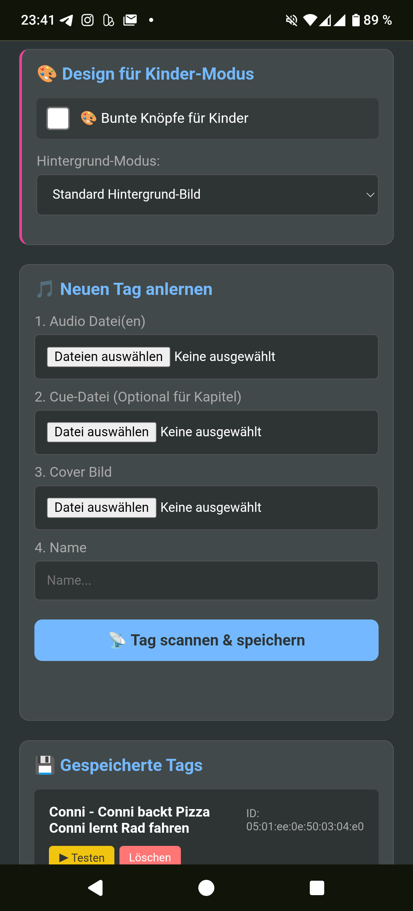

# 🎵 Jukebox PWA (v32) - Die DIY "Toniebox" fürs Handy

Eine kinderfreundliche Musik-Player-App, die als Progressive Web App (PWA) direkt im Browser läuft. Sie ermöglicht es, Musik und Hörspiele über **NFC-Tags** (wie bei einer Toniebox) zu starten. Ideal, um alten Smartphones neues Leben als Kinder-Abspielgerät einzuhauchen.

Entwickelt als lokale Lösung ohne Cloud-Zwang, ohne Tracking und komplett kostenlos.

---

## 📸 Vorschau

| **Eltern-Modus (Admin)** | **Kinder-Modus (Player)** |
|:---:|:---:|
|    |    |
| *Tag-Verwaltung, Settings & Upload* | *Einfache Bedienung, Cover & Visuals* |

---

## 🚫 Bekannte Limitierungen (Bitte lesen!)

Da dies eine Web-App ist, die auf Standard-Smartphone-Hardware läuft, gibt es Unterschiede zur echten Toniebox:

1.  **❌ Keine "Wegnahme"-Erkennung:**
    * Die Musik stoppt **nicht**, wenn die Figur vom Handy genommen wird.
    * *Grund:* Smartphone-NFC-Leser registrieren nur den Moment des "Scannens" (einmaliges Event).
    * *Lösung:* Zum Stoppen muss der Pause-Button auf dem Display gedrückt werden.

2.  **❌ Keine Original-Tonies:**
    * Original Tonie-Figuren können oft nicht gelesen werden (proprietäre Chips/Verschlüsselung oder Störung durch Magnete).
    * *Lösung:* Nutze günstige **NTAG213** oder **NTAG215** Sticker und klebe sie unter eigene Spielfiguren.

3.  **⚠️ iOS / iPhone Einschränkungen:**
    * Apple unterstützt *Web NFC* im Safari-Browser aktuell noch nicht.
    * *Folge:* Auf iPhones funktioniert die App nur als Player (Manuelle Auswahl). Das **Anlernen und Scannen von Tags geht nur unter Android**.

---

## ✨ Features (v32)

### 🎧 Audio & Steuerung
* **💾 Smart Resume (Neu in v32):** Die App speichert die Position sofort beim Pausieren oder Minimieren der App. Beim nächsten Start des gleichen Tags geht es exakt dort weiter.
* **🔊 Intelligente Lautstärkebegrenzung:** Du legst ein Limit fest (z.B. 40%). Der Lautstärkebalken im Kinder-Modus skaliert sich darauf (Logarithmisch).
* **📜 CUE-Sheet Support:** Lade `.cue`-Dateien hoch, um echte Kapitelnamen anzuzeigen und den `⏭️` Skip-Button zu nutzen.
* **⏱️ Anzeige:** Korrekte Zeitanzeige in `mm:ss`.

### 🔋 Energie & Display
* **🌗 Eco-Modus (OLED-Sparmodus):**
    * Legt man das Handy mit dem Display nach unten auf den Tisch, wird der Bildschirm schwarz.
    * Die Musik läuft weiter, das Handy sperrt sich nicht. Spart extrem Akku.
* **💡 Screen Wake Lock:** Verhindert, dass das Handy in den Sperrbildschirm geht (nutzt Video-Loop-Trick für maximale Kompatibilität).

### 🛠️ Technik
* **NFC-Start:** Musik startet sofort beim Scannen eines Tags.
* **Offline-First:** Alle Daten (MP3, Cover) werden im Browser-Speicher (IndexedDB) gehalten.
* **Backup & Restore:** Datenbank kann exportiert und auf anderen Geräten importiert werden.

---

## 🛠️ Installation & Hardware

### 1. Benötigte Hardware
* **Android Smartphone** mit NFC (empfohlen).
* **NFC-Tags** (Typ: NTAG213, NTAG215 oder NTAG216).
* Optional: Bluetooth-Lautsprecher.

### 2. Software-Setup (Hosting)
Damit Sensoren (Eco-Modus) und NFC funktionieren, **MUSS** die App über einen Server laufen.

**Option A: Lokal auf dem Handy (Offline / Empfohlen)**
1.  Erstelle einen Ordner `Jukebox` auf dem internen Speicher des Handys.
2.  Kopiere alle Dateien (`index.html`, `manifest.json`, `sw.js`, Icons, Bilder) dort hinein.
3.  Installiere eine Webserver-App (z.B. *"Web Server for Chrome"*).
4.  Starte den Server und öffne die Adresse (meist `http://127.0.0.1:8080`) in **Chrome**.

**Option B: Online (GitHub Pages)**
1.  Lade die Dateien in ein GitHub Repository hoch (inkl. aller Bilder).
2.  Aktiviere "GitHub Pages" in den Repository-Einstellungen.
3.  Öffne die URL (`https://dein-name.github.io/...`) auf dem Handy.

### 3. Als App installieren (PWA)
1.  Öffne die URL in **Chrome** auf dem Android-Gerät.
2.  Tippe auf das Menü (3 Punkte) -> **"Zum Startbildschirm hinzufügen"** oder **"App installieren"**.
3.  Starte die App nun über das Icon auf dem Homescreen.

---

## 📖 Bedienungsanleitung

### Musik hinzufügen (Eltern-Modus)
1.  Klicke auf **"Neuen Tag anlernen"**.
2.  **Audio:** Wähle die MP3-Datei(en).
3.  **(Optional) Cue:** Wähle eine passende `.cue` Datei für Kapitelmarken.
4.  **Cover:** Wähle ein Bild.
5.  **Name:** Gib dem Hörspiel einen Namen.
6.  Klicke auf **"📡 Tag scannen & speichern"** und halte den NFC-Tag an.

### Einstellungen (WICHTIG!)
* ⚠️ **Hardware-Tasten:** Stelle die physischen Lautstärke-Tasten am Handy auf **100%**.
* **Limit:** Schiebe den Regler "Maximale Lautstärke" auf das gewünschte Limit.
* **Test:** Drücke auf **"🔊 Test-Ton"**, um die Maximallautstärke zu prüfen.

### Kinder-Modus verlassen
Es gibt keinen sichtbaren "Zurück"-Button.
➡️ **Tippe 5x schnell hintereinander in die obere rechte Ecke des Bildschirms.**

---

## 📂 Dateistruktur

* `index.html` - Der komplette Code der App.
* `manifest.json` - PWA Konfiguration.
* `sw.js` - Service Worker (für Offline-Support).
* `icon.png` - App Icon.
* `parent1.png`, `parent2.png`, `parent3.png` - Screenshots Eltern-Modus.
* `children1.png`, `children2.png`, `children3.png` - Screenshots Kinder-Modus.

## 👨‍💻 Credits
Entwickelt von Sebastian Rößer.
Ein Open-Source Projekt für Eltern, die die Kontrolle über ihre Audiodaten behalten wollen.
