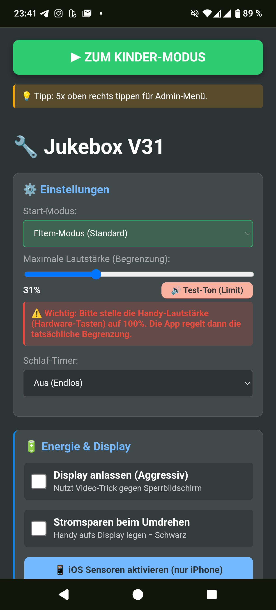
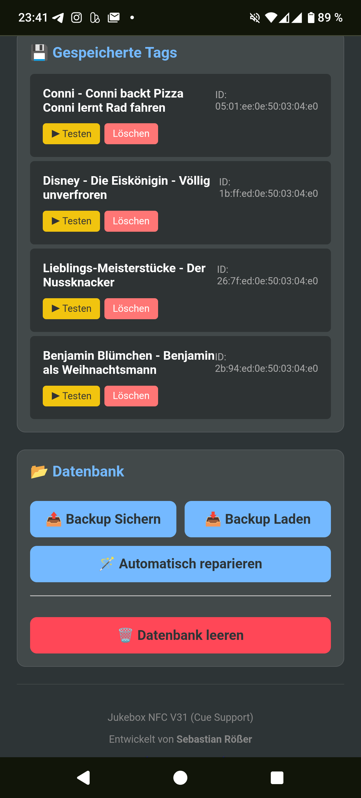
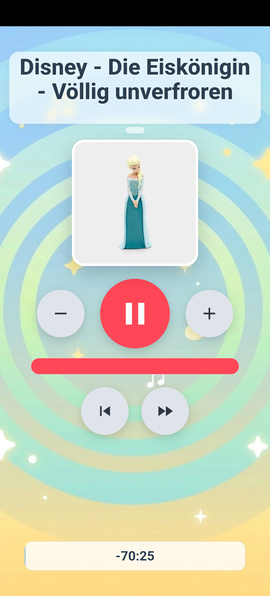

# 🎵 Jukebox PWA (v50( - Die DIY "Toniebox" fürs Handy

Eine kinderfreundliche Musik-Player-App, die als Progressive Web App (PWA) direkt im Browser läuft. Sie ermöglicht es, Musik und Hörspiele über **NFC-Tags** (wie bei einer Toniebox) zu starten. Ideal, um alten Smartphones neues Leben als Kinder-Abspielgerät einzuhauchen.

Entwickelt als lokale Lösung ohne Cloud-Zwang, ohne Tracking und komplett kostenlos.

---

## 📸 Vorschau

| **Eltern-Modus (Admin)** | **Kinder-Modus (Player)** |
|:---:|:---:|
|    |    |
| *Tag-Verwaltung, Settings & Upload* | *Einfache Bedienung, Cover & Visuals* |

---

## ⚠️ Wichtige Hinweise & Limitierungen

Da dies eine Web-App ist, die auf Standard-Smartphone-Hardware läuft, gibt es Unterschiede zur echten Toniebox:

1.  **❌ Keine "Wegnahme"-Erkennung:**
    * Die Musik stoppt **nicht**, wenn die Figur vom Handy genommen wird.
    * *Grund:* Smartphone-NFC-Leser registrieren nur den Moment des "Scannens" (einmaliges Event).
    * *Lösung:* Zum Stoppen muss der Pause-Button auf dem Display gedrückt werden.

2.  **⚠️ iOS / iPhone Einschränkungen:**
    * Apple unterstützt *Web NFC* im Safari-Browser aktuell noch nicht.
    * *Folge:* Auf iPhones funktioniert die App nur als Player (Manuelle Auswahl). Das **Anlernen und Scannen von Tags geht nur unter Android**.

3.  **🔓 Original-Tonies verwenden (Experten-Info):**
    * Grundsätzlich ist die App für **eigene NFC-Sticker (NTAG213/215)** gedacht.
    * Original-Tonies sind oft verschlüsselt oder im "Privacy Mode".
    * **Möglichkeit ("Klopf-Methode"):** Wenn du eine Tonie-Figur verwenden willst, klopfe sie mehrmals schnell gegen eine echte Toniebox (aktiviert). Dies öffnet kurzzeitig den Privacy-Modus, sodass das Handy die ID lesen kann.
    * **Nachteil:** Sobald die Figur wieder regulär auf einer Toniebox stand, ist der Modus wieder zu und du musst erneut "klopfen", bevor das Handy sie erkennt.
    * **Wichtig:** Die App liest **nicht** die Musik von der Figur! Du musst die Audio-Datei (MP3) selbst besitzen und auf das Handy laden.
    * *Tipp:* Um Audio von deinen eigenen Tonies zu sichern/konvertieren, nutze das Python-Script `tools/taf_jukebox_final.py` in diesem Repository.

---

## ✨ Features (v50)

### 🚀 Performance & Komfort
* **📂 Massen-Import (Hybrid / Smart):**
    * Ziehe einen ganzen Ordner mit Hörspielen in die App.
    * **Smart:** Findet die App eine `jukebox.json` (auch `jukebox (3).json` etc.), importiert sie diese mit perfekten Metadaten.
    * **Hybrid:** Findet sie *zusätzlich* noch weitere MP3s im Ordner, fragt sie dich, ob diese ebenfalls (anhand des Dateinamens) importiert werden sollen.
* **🔄 Datenbank Sync:**
    * **Export:** Sichere deine gesamte Bibliothek als JSON-Datei (kompatibel mit dem Python-Script).
    * **Import & Reparatur:** Lade eine Datenbank-Datei und verknüpfe die fehlenden Audio-Dateien automatisch neu.
* **⚡ Auto-Start NFC:** Der Scanner startet nun sofort, wenn der Kinder-Modus geöffnet wird.
* **💾 Smart Resume:** Die App speichert die Position sofort beim Pausieren oder Minimieren.

### 🎧 Audio & Steuerung
* **🔊 Intelligente Lautstärkebegrenzung:** Du legst ein Limit fest (z.B. 40%). Der Lautstärkebalken im Kinder-Modus skaliert sich darauf (Logarithmisch).
* **📜 CUE-Sheet Support:** Lade `.cue`-Dateien hoch, um echte Kapitelnamen anzuzeigen und den `⏭️` Skip-Button zu nutzen.
* **✏️ Edit Mode:** Bearbeite Einträge nachträglich, tausche Cover oder ziehe sie auf neue NFC-Tags um.

### 🔋 Energie & Display
* **🌗 Eco-Modus (OLED-Sparmodus):**
    * Legt man das Handy mit dem Display nach unten auf den Tisch, wird der Bildschirm schwarz. Spart extrem Akku.
* **💡 Screen Wake Lock:** Verhindert, dass das Handy in den Sperrbildschirm geht (nutzt Video-Loop-Trick für maximale Kompatibilität).

---

## 🛠️ Installation & Hardware

### 1. Benötigte Hardware
* **Android Smartphone** mit NFC (empfohlen).
* **NFC-Tags** (Typ: NTAG213, NTAG215 oder NTAG216) – oder Original-Tonies.
* Optional: Bluetooth-Lautsprecher.

### 2. Software-Setup (Hosting)
Damit Sensoren (Eco-Modus) und NFC funktionieren, **MUSS** die App über einen Server laufen.

**Option A: Lokal auf dem Handy (Offline / Empfohlen)**
1.  Erstelle einen Ordner `Jukebox` auf dem internen Speicher des Handys.
2.  Kopiere alle Dateien und Ordner (`index.html`, `assets/`, `sw.js`, etc.) dort hinein.
3.  Installiere eine Webserver-App (z.B. *"Web Server for Chrome"*).
4.  Starte den Server und öffne die Adresse (meist `http://127.0.0.1:8080`) in **Chrome**.

**Option B: Online (GitHub Pages)**
1.  Lade die Dateien in ein GitHub Repository hoch (inkl. aller Unterordner).
2.  Aktiviere "GitHub Pages" in den Repository-Einstellungen.
3.  Öffne die URL (`https://dein-name.github.io/...`) auf dem Handy.

---

## 📖 Bedienungsanleitung

### Musik hinzufügen (Eltern-Modus)

**Variante A: Einzeln**
1.  Klicke auf **"Neuen Tag anlernen"**.
2.  Wähle Audio, (optional) Cue und Cover.
3.  Wähle **"📡 Tag scannen"** (NFC) oder **"💾 Ohne NFC speichern"** (Liste).

**Variante B: Massen-Import (Empfohlen)**
1.  Klicke auf **"📂 Massen-Import (Ordner)"**.
2.  Wähle deinen Ordner mit Hörspielen aus (z.B. den Output vom Python-Script).
3.  Bestätige den Upload-Dialog des Browsers (Daten bleiben lokal!).
4.  Die App erkennt automatisch die `jukebox.json` und importiert alles perfekt.
5.  *Hinweis:* Bei Dateien ohne JSON müssen MP3, Cover und Cue den **exakt gleichen Dateinamen** haben.

**Variante C: Datenbank wiederherstellen**
1.  Klicke auf **"📥 Datenbank laden"** und wähle deine `jukebox.json`.
    * *Jetzt sind die Titel in der Liste, aber die Musik fehlt noch (da JSON nur Text ist).*
2.  Klicke auf den Button **"🪄 Automatisch reparieren"** (der jetzt rot blinken sollte).
3.  Wähle den Ordner aus, in dem deine MP3-Dateien liegen. Die App verknüpft sie automatisch wieder.

### Einstellungen (WICHTIG!)
* ⚠️ **Hardware-Tasten:** Stelle die physischen Lautstärke-Tasten am Handy auf **100%**.
* **Limit:** Schiebe den Regler "Maximale Lautstärke" auf das gewünschte Limit.
* **Test:** Drücke auf **"🔊 Test-Ton"**, um die Maximallautstärke zu prüfen.

### Kinder-Modus verlassen
Es gibt keinen sichtbaren "Zurück"-Button.
➡️ **Tippe 5x schnell hintereinander in die obere rechte Ecke des Bildschirms.**

---

## 📂 Dateistruktur

* `index.html` - Der komplette Code der App.
* `manifest.json` - PWA Konfiguration.
* `sw.js` - Service Worker (für Offline-Support).
* `assets/`
    * `img/` - Hintergrundbilder.
    * `icons/` - App Icons für Android/iOS.
    * `limit.mp3` - Test-Audio Datei für Lautstärke.
* `docs/screenshots/` - Bilder für diese Anleitung.
* `tools/`
    * `taf_jukebox_final.py` - Python-Script zum Erstellen der Datenbank aus Tonie-Dateien.

---

## 🔗 Projekt & Support

Du findest den Quellcode, Updates und Hilfe auf GitHub.  
Hast du einen Fehler gefunden oder eine Idee für ein neues Feature? Erstelle gerne ein Issue!

* 🏠 **Projekt:** [github.com/basecore/jukebox](https://github.com/basecore/jukebox/)
* 🐛 **Fehler melden:** [Issues & Bugs](https://github.com/basecore/jukebox/issues)

## 👨‍💻 Credits
Entwickelt von Sebastian Rößer.
Ein Open-Source Projekt für Eltern, die die Kontrolle über ihre Audiodaten behalten wollen.
