# 🎵 KlangKiste PWA (V84 Legacy Audio Update)

**Die smarte DIY "Toniebox" fürs Handy – 100% AI-Generated Code.**

Dieses Projekt ist eine kinderfreundliche Musik-Player-App, die alte Smartphones in sichere, werbefreie Abspielgeräte verwandelt. Sie läuft als **Progressive Web App (PWA)** komplett offline im Browser und nutzt IndexedDB zur Speicherung von hunderten Hörspielen.

> 🤖 **Made with Gemini:** Dieses gesamte Projekt (HTML, CSS, JavaScript Logik, Datenbank-Struktur) wurde vollständig durch **Google Gemini 3 Pro** erstellt und analysiert. Es ist ein Experiment, wie weit KI-gestützte Entwicklung ohne manuelles Coden gehen kann.

---

## 🔧 Neu in v84: Audio-Logik & Legacy Support

Dieses Update konzentriert sich vollständig auf die Stabilität und Kompatibilität mit älteren Smartphones (z.B. Samsung Galaxy S8, Android 8/9).

### 1. Rückkehr zur V81 Audio-Engine
Nach Problemen mit verzerrtem Ton und Stottern in V83 wurde die Audio-Logik wieder auf den robusten Kern der Version 81 zurückgesetzt.
* **Keine Web Audio API Abhängigkeit:** Der Player nutzt für die Wiedergabe und den Test-Ton wieder rein native Android-Funktionen (`HTML5 Audio Element`). Das verhindert "Roboter-Stimmen" oder zu schnelle Wiedergabe auf älteren Prozessoren.
* **Ressourcenschonend:** Der Verzicht auf komplexe Audio-Kontexte entlastet die CPU massiv.

### 2. Optimierter Sleep-Timer
Die visuellen Funktionen der V83 bleiben erhalten, aber die technische Umsetzung wurde bereinigt:
* **Entkoppelte Timer:** Der visuelle Sekunden-Countdown läuft getrennt von der Audio-Steuerung.
* **Hard-Stop statt Fading:** Um Abstürze beim Einschlafen zu verhindern, wird die Musik am Ende des Timers sofort gestoppt, statt rechenintensiv ausgefadet zu werden. Das garantiert, dass das Handy auch wirklich "schlafen geht".

---

## 🌙 Neu in v83: Der intelligente Schlafmodus

Für eine noch bessere Einschlafbegleitung wurde der Schlafmodus (Timer) komplett überarbeitet. Er bietet nun eine visuelle Bestätigung und spart maximal Energie.

### 1. Visuelles Einschlafen
Sobald der Timer abgelaufen ist, schaltet die App in eine beruhigende Schlaf-Ansicht. 
* **Schlaf-Design:** Ein spezieller Nacht-Hintergrund mit einer sanft animierten, schlafenden Note zeigt dem Kind, dass die "KlangKiste" nun auch schläft.
* **Sanftes Pulsieren:** Die Note "atmet" visuell durch eine langsame Animation, was eine beruhigende Wirkung hat.

### 2. Auto-Blackout (Energie sparen)
Um das Zimmer vollkommen dunkel zu halten und den Akku zu schonen, folgt nach der visuellen Phase die totale Dunkelheit:
* **60-Sekunden-Timer:** Nach genau einer Minute in der Schlaf-Ansicht schaltet das Display automatisch auf **komplett Schwarz**.
* **Kein Leuchten mehr:** Da keine Pixel mehr beleuchtet werden, stört kein Handy-Licht den tiefen Schlaf.
* **Geheim-Ausgang:** Auch im Blackout-Modus bleibt das "Geheim-Feld" oben rechts aktiv. Eltern können die App jederzeit durch 5-maliges Tippen aufwecken und entsperren.

---

## 🎧 Neu in v82: OHRKA Hörbücher (Offline)

KlangKiste unterstützt nun direkt die Integration von hochwertigen, kostenlosen Hörbüchern des Portals **OHRKA**. Da Browser direkte Downloads von fremden Seiten oft blockieren (CORS), nutzt die App einen smarten **2-Schritte-Prozess**, um die Dateien **100% offline** verfügbar zu machen:

1.  **Installation:** Wähle "OHRKA Installation". Die App lädt Titel, Beschreibungen, Kapitelmarken und Cover in die Datenbank.
2.  **Verknüpfung:** Du erhältst in einem Fenster Download-Links für die MP3s. Lade diese herunter und nutze dann den Button **"🪄 Automatisch reparieren"**. Die App erkennt die Dateien automatisch anhand ihres Namens und verknüpft sie mit den Einträgen.

---

## ✨ Neu in v81: Die Live-Suche

Auf vielfachen Wunsch wurde die Navigation in großen Bibliotheken massiv beschleunigt.

### 🔎 Blitzschnelle Live-Suche
Im Eltern-Modus findest du nun ganz oben eine prominente Suchleiste.
* **Echtzeit-Filter:** Tippe einfach drauf los – die Liste filtert sich sofort, noch während du schreibst.
* **Intelligent:** Die Suche durchforstet Titel, Seriennamen und Beschreibungen.
* **Kombinierbar:** Funktioniert perfekt zusammen mit der neuen **Listen-Ansicht**, um auch bei 500+ Hörspielen sofort das Richtige zu finden.

---

## 🛡️ Safe-Import & Filter (V80 Highlights)

Weiterhin enthalten sind die mächtigen Import-Funktionen der V80, die dir die volle Kontrolle darüber geben, was auf dem Gerät landet. Nie wieder überfüllter Speicher oder unpassende Inhalte!

### 1. Safe-Import Vorschau
Wenn du einen Ordner mit hunderten Hörspielen auswählst, schreibt die App diese nicht mehr blind in den Speicher (was oft zu Abstürzen führte).
* **Vorschau-Fenster:** Stattdessen öffnet sich eine Liste aller gefundenen Alben.
* **Selektiver Import:** Du kannst genau anhaken, welche Hörbücher importiert werden sollen.
* **Speicher-Schutz:** Der Browser wird nicht mehr überlastet, da der Import seriell (nacheinander) und kontrolliert abläuft.

### 2. Intelligente Filter & Alters-Schutz
Im Import-Fenster stehen dir nun mächtige Werkzeuge zur Verfügung:
* **Alters-Filter (Min/Max):** Gib z.B. "Bis 4 Jahre" ein. Die App filtert die Liste sofort und zeigt nur noch altersgerechte Inhalte an (basiert auf Daten aus der `klangkiste.json` oder Metadaten).
* **Negativ-Suche (-):** Willst du eine bestimmte Serie *nicht* importieren? Schreibe einfach ein Minus vor den Begriff.
    * *Beispiel:* `-paw` -> Entfernt sofort alle "Paw Patrol" Folgen aus der Auswahl.
    * *Beispiel:* `-grusel` -> Entfernt alles mit "Grusel" im Titel.
* **Massen-Steuerung:** Die Buttons "Alle sichtbaren an/aus" reagieren auf deine Filter. So kannst du z.B. erst nach "Conni" filtern und dann mit einem Klick nur alle Conni-Folgen auswählen.

---

## 🚀 Weitere Features (Smart Folder & Performance)

### 📂 Smart Folder Struktur-Import
Du hast deine Hörspiele am PC bereits in Ordnern sortiert? Perfekt!
* **Wie es funktioniert:** Wähle einen Oberordner (z.B. "Meine Hörspiele") aus.
* **Die Magie:** Die App erkennt automatisch jeden Unterordner als **eigenes Album**.
* **Beispiel:**
    * `Hörspiele/Benjamin Blümchen/01 - Zoo.mp3` -> Wird Album "Benjamin Blümchen"
* **Automatische Cover:** Wenn in einem Ordner ein Bild (jpg/png) liegt, wird es automatisch als Cover für dieses Album gesetzt.

### ⚡ Admin Listen-Ansicht
Für Eltern mit großen Sammlungen (500+ Alben):
* **Umschaltbar:** Im Eltern-Modus kannst du nun zwischen **Raster (Grid)** und **Liste** umschalten.
* **Performance:** Die Listen-Ansicht benötigt kaum Rechenleistung und lädt sofort, auch auf sehr alten Handys.

---

## 📸 Vorschau

Die App ist in zwei Bereiche unterteilt: Den geschützten **Eltern-Modus** (Verwaltung) und den kindersicheren **Player-Modus**.

### 👶 Kinder-Modus & Bibliothek

Hier spielen die Kinder. Große Bilder, keine Text-Menüs, einfache Bedienung.

| **Der Player** | **Die Bibliothek** |
|:---:|:---:|
| 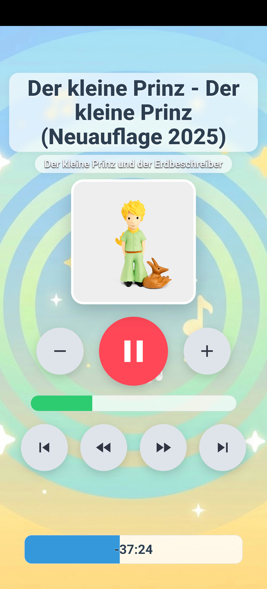 | 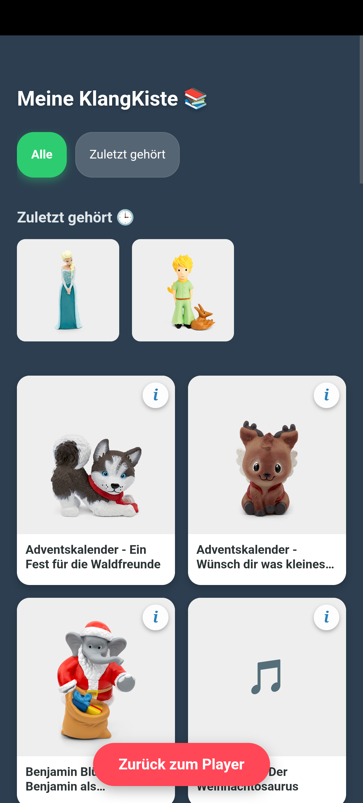 |
| *Große Steuerung & Cover* | *Visuelles Stöbern & Filtern* |

| **Info-Overlay** | **Details & Dauer** |
|:---:|:---:|
| 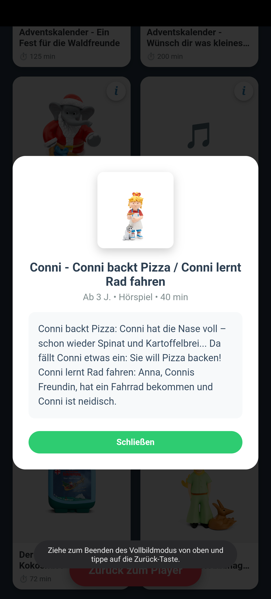 | 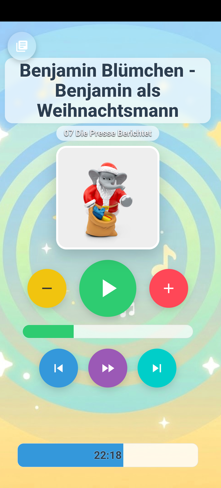 |
| *Beschreibung & Alter* | *Einfacher Player* |

### 🔧 Eltern-Modus & Statistik

Verwaltung der Inhalte und Einsicht in das Nutzungsverhalten.

| **Verwaltung** | **Statistik** |
|:---:|:---:|
| 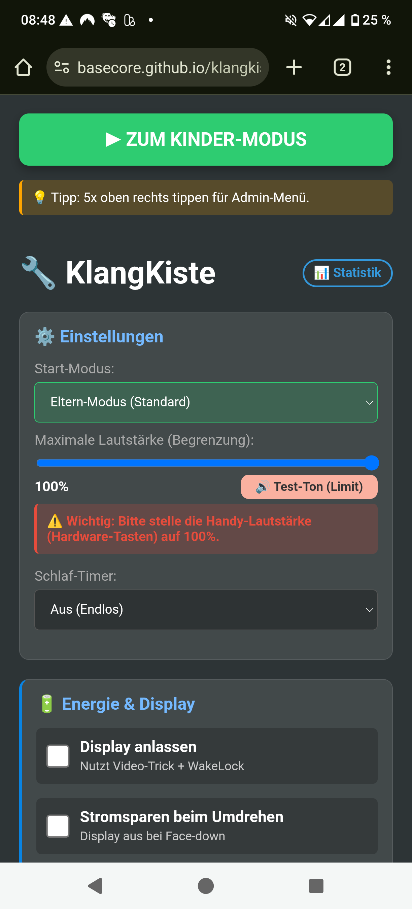 | 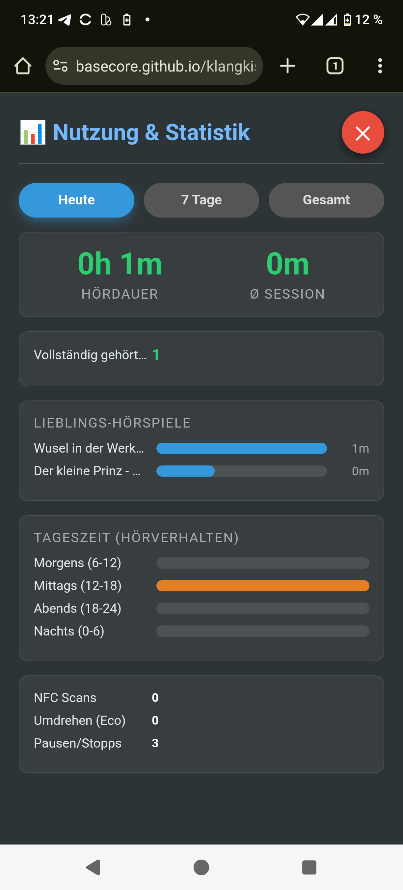 |
| *Suche, Smart Folder & Tags* | *Timeline & Fortschritt (✅)* |

---

## 🌍 Direkt im Browser nutzen (Ohne Installation)

Du musst die App nicht zwingend installieren. Du kannst sie auch einfach direkt als Webseite verwenden:

👉 **[https://basecore.github.io/klangkiste/](https://basecore.github.io/klangkiste/)**

**Hinweis:** Die App funktioniert auch so vollumfänglich und speichert deine Datenbank im Browser. Deine Daten bleiben erhalten, **solange du deine Browser-Daten (Cache/Webseitendaten) nicht löschst**.

---

# 📲 Installation (Android)

Die App muss nicht über den Play Store geladen werden, sondern wird direkt über den Browser installiert.

1. Öffne **Chrome** auf deinem Android-Smartphone.
2. Rufe die Webseite auf: **https://basecore.github.io/klangkiste/**
3. **Warte kurz (bis zu 30 Sekunden):** Oft erscheint am unteren Bildschirmrand automatisch ein Hinweis „KlangKiste zum Startbildschirm hinzufügen".
4. Falls nicht, folge diesen Schritten:

| **1. Menü öffnen** | **2. Installieren** |
|:---:|:---:|
| 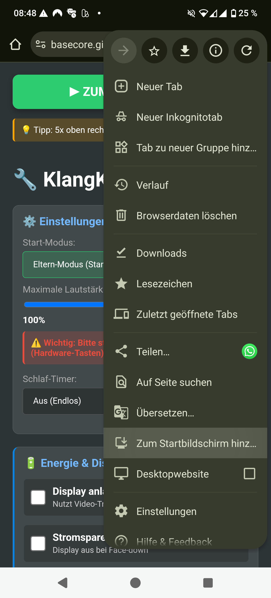 | 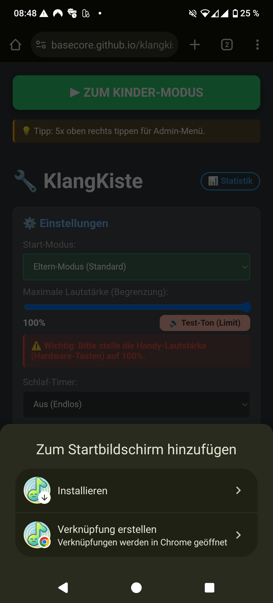 |
| *Tippe oben rechts auf die 3 Punkte* | *Wähle „App installieren"* |

| **3. Bestätigen** | **4. Widget platzieren** |
|:---:|:---:|
| 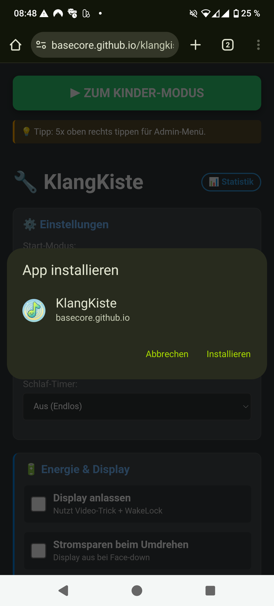 | 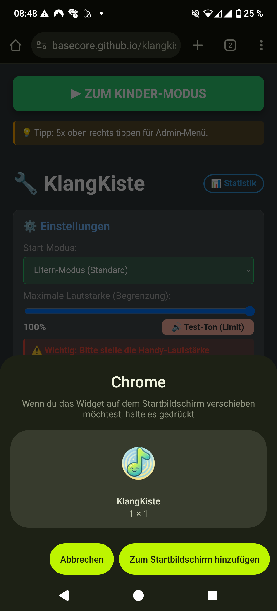 |
| *Klicke auf „Installieren"* | *Automatisch oder ziehen* |

*(iOS Nutzer verwenden Safari → Teilen → Zum Home-Bildschirm)*

---

## 📖 Bedienung & Musik hinzufügen

### 1. Musik importieren (5 Wege)

* **A) Ordner-Struktur Import (Smart - Empfohlen):**
    Der beste Weg für sortierte Sammlungen. Wähle deinen Haupt-Ordner. Es öffnet sich das neue **Import-Fenster**, in dem du nach Alter filtern oder unerwünschte Serien ausschließen kannst, bevor sie importiert werden.
* **B) Massen-Import (Dateien):**
    Für lose MP3s oder wenn du unser Python-Tool nutzt. Wähle Dateien und die `klangkiste.json` aus. Auch hier greift der neue **Safe-Filter**.
* **C) OHRKA Installation (Neu):**
    Nutze die neue V82 Funktion, um OHRKA-Hörbücher in zwei Schritten (Metadaten installieren -> MP3 downloaden & verknüpfen) offline verfügbar zu machen.
* **D) Online-Beispiele:**
    Lade mit einem Klick vorbereitete KI-generierte Hörspiele direkt vom Server (zum Testen).
* **E) Manuell anlernen:**
    Gehe auf „Neuen Tag anlernen", wähle Audio & Bild einzeln und fülle Details wie Beschreibung und Alter aus.

### 2. Backups & Restore

* **Sichern:** Klicke auf **"Datenbank exportieren"**. Dies speichert eine Datei (`klangkiste_full_backup_DATUM.json`), die all deine Fortschritte, Einstellungen und Statistiken enthält.
* **Wiederherstellen:** Lade diese Datei über **"Datenbank laden"**. Die App erkennt automatisch das Format. Da Browser aus Sicherheitsgründen keine Audio-Dateien exportieren dürfen, klicke danach auf den (rot blinkenden) Button **"Automatisch reparieren"** und wähle deinen MP3-Ordner erneut aus.

### 3. NFC Tags nutzen (Optional)

Wenn dein Android-Gerät NFC hat:
1. Gehe auf „Tag scannen & speichern".
2. Halte eine NFC-Karte oder Figur an das Handy.
3. Die Musik ist nun mit diesem Tag verknüpft. Im Kinder-Modus startet sie sofort beim Auflegen.

### 4. Kinder-Modus verlassen

Es gibt keinen sichtbaren „Zurück"-Button, damit Kinder die App nicht versehentlich schließen.
➡️ **Tippe 5× schnell hintereinander in die obere rechte Ecke des Bildschirms, um in den Eltern-Modus zurückzukehren.**

---

## 🪄 Python Tools: Automatisch Inhalte erstellen

Wir bieten zwei mächtige Python-Tools an, um Inhalte am PC vorzubereiten und dann einfach in die App zu laden.

### 1. TAF zu KlangKiste (Tonie-Format)

Hast du eigene **.taf** Dateien? Das Script `taf_klangkiste_final.py` konvertiert diese vollautomatisch.

* **Funktion:** Wandelt `.taf` in `.mp3`, lädt Original-Cover und Metadaten (Alter, Genre) von der Webseite und erstellt eine `klangkiste.json`.
* **Ort:** `tools/taf_klangkiste_final.py`

### 2. OHRKA Importer (Neu!)

Du möchtest alle OHRKA Hörbücher bequem am PC herunterladen und für die App vorbereiten?

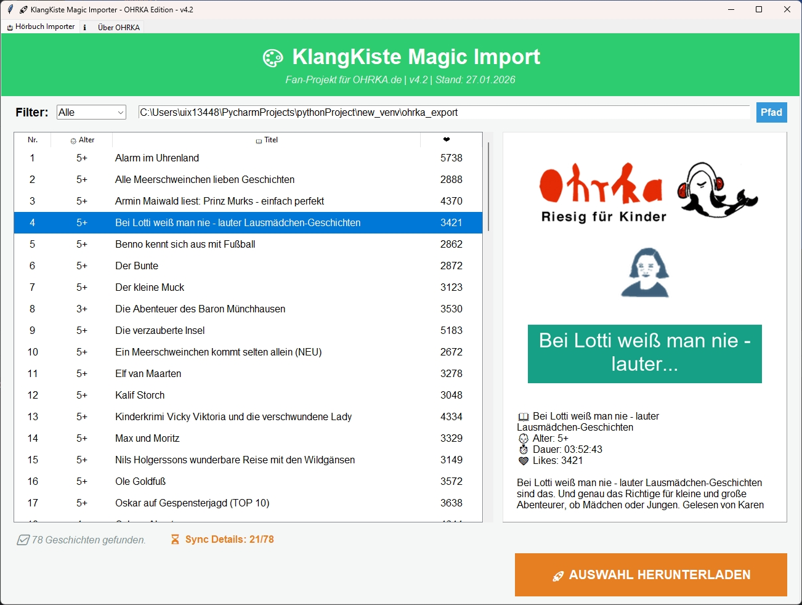

* **Funktion:** Dieses Tool bietet eine grafische Oberfläche (GUI), um MP3s, Cover und Metadaten von OHRKA zu laden und direkt im passenden Format für den **Massen-Import** der KlangKiste zu speichern.
* **Ort:** [`tools/ohrka_importer.py`](https://github.com/basecore/klangkiste/blob/main/tools/ohrka_importer.py)

---

## 📂 Dateistruktur

* `index.html` – Der gesamte Quellcode der Anwendung (Logik & Design, v84)
* `sw.js` – Der Service Worker für die Offline-Funktionalität (Cache v76+)
* `manifest.json` – Konfiguration für das App-Icon und den Vollbild-Modus
* `assets/` – Ordner für Icons und Test-Sounds
* `example/` – Beispieldateien (MP3s, PNGs, `klangkiste.json`) für schnellen Start
* `tools/` – Enthält die Python-Scripts (TAF Converter & OHRKA Importer)
* `docs/screenshots/` – Screenshots für diese Anleitung

---

## 📟 Hardware: Der ESP32 Unlocker

Du möchtest **Tonie-Figuren einfach entsperren** ohne die "Klopf-Methode" anwenden zu müssen oder die **exakte UID auslesen**, um sie in der App zu nutzen?
Wir haben ein DIY-Diagnose-Tool auf Basis eines ESP32 und PN5180 entwickelt.

👉 **[Hier geht es zur Hardware-Dokumentation & Bauanleitung](hardware/esp32_unlocker/README.md)**

* **Funktionen:** Privacy Mode deaktivieren, Audio-ID auslesen, Chip-Diagnose.
* **Kosten:** < 15€
* **Kein Bluetooth nötig:** Arbeitet als Standalone-Tool.

---

## 🔗 Projekt & Support

* 🏠 **Projekt:** https://github.com/basecore/klangkiste
* 🐛 **Fehler melden:** https://github.com/basecore/klangkiste/issues

## 👨‍💻 Credits

Entwickelt von Sebastian Rößer mit Unterstützung von **Google Gemini 3 Pro**.
Version 84 „Legacy Audio Update".
